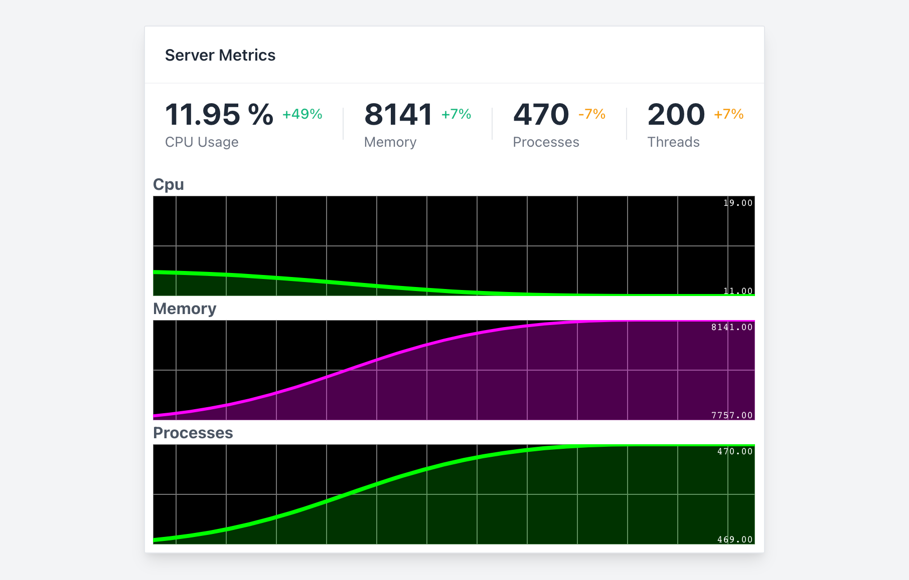

# cmdpiped

`cmdpiped` is a command-line tool for exposing a wrapped cli program's standard IO to WebSockets/SSE

## Installation

Ready to use Binaries are available at the releases page.

For Rust users, you can always use cargo

```
cargo install cmdpiped
```

## Usage

```
USAGE:
    cmdpiped [OPTIONS] --mode <MODE> [SUBCOMMAND]

OPTIONS:
    -h, --host <HOST>      Host address to bind [default: 127.0.0.1]
        --help             Print help information
    -m, --mode <MODE>      Mode to expose events [possible values: ws, sse]
    -p, --port <PORT>      Port to bind [default: 9000]
        --path <PATH>      Url path to setup [default: /events]
        --serve <SERVE>    Optional folder path to serve static files
    -V, --version          Print version information
```

You can also use piping

```
$ node ./index.js | cmdpiped -m sse
```

## Examples

### Some Basic Examples

`cmdpiped` is language agnostic and should be able to plugin easily for anything that can run on the command line.

<details>
  <summary>Python</summary>

```py
from sys import stdout
from time import sleep

# Count to 100 sleeping every second
for count in range(0, 100):
  print(count + 1)
  stdout.flush()
  sleep(1)
```

Save the file as `counter.py` and run the `cmdpiped`

```
$ cmdpiped -m sse python3 ./counter.py
```

</details>
<details>
  <summary>Node.js</summary>

```js
let count = 0;

setInterval(() => {
  console.log(count++);
}, 1000);
```

Save the file as `index.js` and run the `cmdpiped`

```
$ cmdpiped -m sse node ./index.js
```

</details>

<details>
  <summary>Bash</summary>

```sh
#!/bin/bash

# Count from 1 to 100 with a sleep of 1 second
for ((COUNT = 1; COUNT <= 100; COUNT++)); do
  echo $COUNT
  sleep 1
done
```

Save the file as `index.js` and run the `cmdpiped`

```
$ cmdpiped -m sse node ./index.js
```

</details>

You should be able to get:

```
[2022-07-24T13:41:11Z TRACE actix_server::worker] Service "actix-web-service-127.0.0.1:9000" is available
[2022-07-24T13:41:11Z TRACE cmdpiped::broadcaster] Send: "data: 1\n\n"
[2022-07-24T13:41:11Z TRACE cmdpiped::broadcaster] Send: "data: 2\n\n"
[2022-07-24T13:41:12Z TRACE cmdpiped::broadcaster] Send: "data: 3\n\n"
[2022-07-24T13:41:13Z TRACE cmdpiped::broadcaster] Send: "data: 4\n\n"
...
```

### Advanced Example

Using the above example, we can add some frontend code

1. Create a folder called `static`.
2. Add an `index.html` file:

```html
<!DOCTYPE html>
<html>
  <head>
    <script type="text/javascript">
      var source = new EventSource("http://localhost:9000/events");
      source.onmessage = function (event) {
        var content = document.getElementById("content");
        content.innerHTML = content.innerHTML + event.data + "<br/>";
      };
    </script>
  </head>
  <body>
    <div id="content"></div>
  </body>
</html>
```

Run `cmdpiped` exposing a directory

```
$ cmdpiped -m sse --serve ./static
```

### A complete example

A complete example is available in the [examples](./examples/monitor/)



## Versioning

We use [SemVer](http://semver.org/) for versioning. For the versions available, see the [tags on this repository](https://github.com/geofmureithi/cmdpiped/tags).

## Authors

- **Njuguna Mureithi** - _Initial work_ - [Njuguna Mureithi](https://github.com/geofmureithi)

See also the list of [contributors](https://github.com/geofmureithi/cmdpiped/contributors) who participated in this project.

## License

This project is licensed under the MIT License - see the [LICENSE.md](LICENSE.md) file for details
